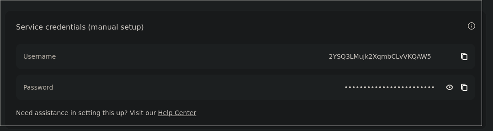

I am currently setting up a [Kubernetes](https://kubernetes.io) cluster, and wanted to setup a torrent client within the cluster.
Previously, I was using [Truenas](https://www.truenas.com) for my self hosting on-prem needs, which provides a nice mechanism to force a pod's
network to route through an OpenVPN container.
Not wanting to do something like that, I looked into other options and found that both [NordVPN](https://nordvpn.com) and Deluge support Socks5 Proxies! This is pretty sweet, as last I knew neither supported socks proxies.
Therefore, today I'm going to show you how to set this up yourself.

---

To get started, log in to your nord vpn console. If you're like me and the last time you logged in was five years ago, you can find the console [here](https://my.nordaccount.com/dashboard/nordvpn/manual-configuration/). 

You need to go to the `Manual Configuration` section down at the bottom, then get your username and password.

Now with your credentials, log into
