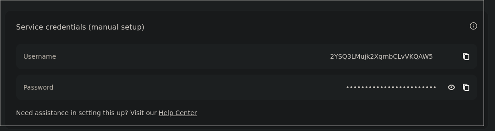

I am currently setting up a [Kubernetes](https://kubernetes.io) cluster, and wanted to setup a torrent client within the cluster.
Previously, I was using [Truenas](https://www.truenas.com) for my self hosting on-prem needs, which provides a nice mechanism to force a pod's
network to route through an OpenVPN container.
Not wanting to do something like that, I looked into other options and found that both [NordVPN](https://nordvpn.com) and Deluge support Socks5 Proxies! This is pretty sweet, as last I knew neither supported socks proxies.
Therefore, today I'm going to show you how to set this up yourself.

---

To get started, log in to your nord vpn console. If you're like me and the last time you logged in was five years ago, you can find the console [here](https://my.nordaccount.com/dashboard/nordvpn/manual-configuration/). 

You need to go to the `Manual Configuration` section down at the bottom, then get your username and password.



Now with your credentials, log into deluge with the same credentials. You'll be presented a few option which I can provide below.

- Type : `Socks5 Auth` 
- Port : `1080` 
- [x] Proxy Hostnames
- [x] Proxy Peers
- [x] Proxy Trackers
- [x] Force use of proxy

For the hostname, just choose from any of the below hostnames. For better performance, I'd recomend choosing one that is somewhat close to you.

```
amsterdam.nl.socks.nordhold.net  
atlanta.us.socks.nordhold.net  
dallas.us.socks.nordhold.net  
los-angeles.us.socks.nordhold.net  
nl.socks.nordhold.net  
se.socks.nordhold.net  
stockholm.se.socks.nordhold.net  
us.socks.nordhold.net  
new-york.us.socks.nordhold.net
```

Thats it! Try out downloading something like [Big buck bunny](big-buck-bunny.torrent), or something else that won't upset your ISP. Then check [I know what you download](https://iknowwhatyoudownload.com/en/peer/) and see if you see your torrent. If you don't see it after a few hours, then you should be good to go!

