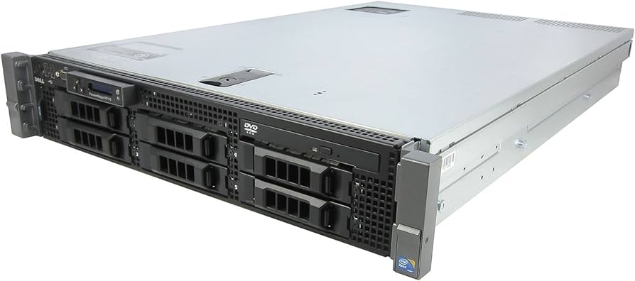

I was fortunate enough to get my hands on a sweet little Poweredge R710, a older Dell 2U system.
They came in alot of configurations, but mine happened to come configured with two quad core Xeon CPUs, 64 gigs of ram, and six drive bays.
Its not terribly power efficient, fast, or quiet, but it sure is fun.

So with the addition of this machine, I decided to embark on tackling running [Kubernetes](https://kubernetes.io) at home, specficially [k3s](https://k3s.io). 
To be honest, other than pure curiosity, and the desire to leverage all the compute available to me, I don't really have a good reason for doing this. 
Something something overcomplicating, but who cares! This is all just for fun, and for me to learn, so its impact is pretty small (other than my sanity).

So I followed [Funky Penguin's](https://geek-cookbook.funkypenguin.co.nz/) guide to k3s, at least as a starting point. I definitly didn't do what he
does one-to-one, partly because I didn't fully understand why he did some of the layouts he did. Prior to this, my experience with kubernetes was 
limited to [TrueNAS](https://www.truenas.com/) and some light kubernetes stuff I experimented with in college, so I went in pretty much blind.

If you want to know the details, you can find my [Flux](https://www.truenas.com/) repo [here](https://git.clortox.com/Infrastructure/Gluttony-Cluster). 
I'll spare a bunch of the technical details on my specific implementation, as it is both bound to change, 
and I really don't know enough to make strong comments on it.

I've found over the less than one month I've had this, that it really has been worth the work. I like the even distrobution across my machines.
I've found the reasonably high up time to be very useful, as I can worry less about a container dying and inevitably getting
some complaint from friends and family about it. Once you get it set up, its pretty set and forget for the most part.

Now the setup is by far the worst part. If you have limited familiarity with kubernetes like myself, you may find that its pretty
frustrating at first, and somewhat tricky to get your head around. Once you work with it for a few hours setting up a cluster, 
it becomes far more intuitive, however that first part of the journey is tough. I set aside a weekend to get it rolling, and got some basic
services running like [Longhorn](https://longhorn.io), Postgres, Redis, [Minio](https://min.io), etc. Basically just stuff everything else would need.

There was a minuite that I wanted to replicate a full cloud provider, however I'm finding that I both do not need it, and its really not worth the hassle.
I'm fine with running a few containers as opposed to having a deticated serverless runtime for an at home cluster that will get limited usage.

The cost has been pretty low, as I have only have three machines running everything currently, and they are all both old and purchased for free/cheap.
I am currently working on getting my main desktop to join in the cluster at certain times of day, to support its usage when I'm away from the desktop.
When I do implement that, though, I will for sure be writing up a guide to doing this.

If you also want to try this, I'm willing to provide any guidance I can, just shoot me an email with any questions.
